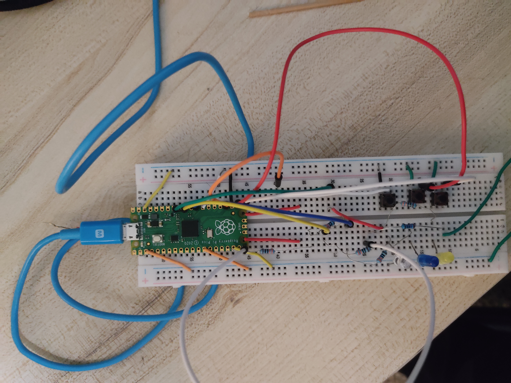

# Arcade-Sound-FX-Box-Raspberry-Pi-Pico

## Overview
The Arcade Sound FX Box is a fun embedded project using a Raspberry Pi Pico, 3 push buttons, and 3 LEDs.
Each button triggers a unique retro sound effect, while the corresponding LED lights up during playback. The design mimics classic arcade machines, making it both educational and visually engaging.
working: https://youtu.be/knK2-xbdAw0?si=duYQYvvJuWSMpVN_

Features
- 3 buttons: Coin, Laser, Explosion
- 3 LEDs synced to the sound effects
- PWM-based retro sound synthesis — no extra audio modules required
- Debounced button input for reliable single-press detection
- Fully standalone: runs on Pico with USB power, no laptop needed

Components Needed

- Raspberry Pi Pico
- 3 push buttons (tactile, 4-pin)
- 3 LEDs + 220Ω resistors
- Speaker (100–220Ω resistor in series)
- Breadboard and jumper wires

How It Works
- Press a button → triggers the corresponding sound effect
- The corresponding LED lights up while the sound plays
- Uses PWM to generate square-wave retro tones
- Implements edge detection to avoid continuous playback
